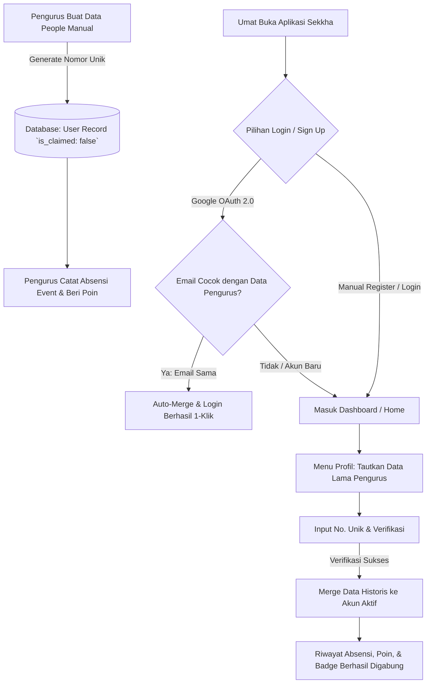

# PRD: People Management & Account Linking (Pre-Provisioned Users & OAuth Linking) — Sekkha Apps

| Metadata | Detail |
| --- | --- |
| **Dokumen** | Product Requirement Document (PRD) |
| **Fitur** | People Management (Pre-provisioning User), Auto-Linking OAuth 2.0, & Post-Login Account Linking (Klaim via Profil) |
| **Aplikasi** | Sekkha Apps (Frontend & Backend) |
| **Versi** | 1.0.0 |
| **Status** | Approved / Ready for Development |
| **Referensi Terkait** | `prd-sekkha/auth/auth.md`, `prd-sekkha/profile/profile.md`, `prd-sekkha/event/abensiEvent.md` |

---

## 1. Ringkasan Eksekutif & Latar Belakang Masalah

Di komunitas vihara / organisasi pemuda Buddhis, kegiatan absensi dan pendataan seringkali berlangsung di lapangan jauh sebelum umat/peserta memiliki akun aplikasi Sekkha. Pengurus vihara membutuhkan fleksibilitas untuk:
1. **Mendaftarkan Umat Secara Manual (Pre-provisioning People/User)**: Pengurus dapat membuat profil umat baru (Nama, Nomor Unik / Nomor Anggota, Kontak, Sekolah) dan langsung mencatat absensi mereka pada event-event rutin.
2. **Klaim Akun & Penyambungan Akun (Account Linking)**: Ketika umat tersebut akhirnya mengunduh aplikasi dan mendaftar (baik via **Manual Sign-Up** maupun **Google OAuth 2.0**), akun mereka dapat ditautkan dengan data yang sudah dibuat oleh pengurus.
3. **Mencegah Duplikasi & Reset Data**: Seluruh riwayat kehadiran (*attendances*), lencana (*badges*), tingkat level, poin, dan histori keterlibatan yang telah dicatat sebelumnya **tidak hilang / ter-reset**.
4. **Post-Login Account Linking dari Menu Profil**: Jika user tidak sengaja terlanjur memilih *"Saya Pengguna Baru"* saat login pertama kali, mereka tetap dapat menautkan Nomor Unik mereka di kemudian hari melalui menu **Profil / Pengaturan**.

---

## 2. Target Pengguna & Peran (Roles)

| Role | Peran dalam Fitur Ini |
| --- | --- |
| `pengurus` / `admin` | Menambahkan data People/User secara manual di panel Pengurus, melihat daftar anggota (status diklaim / belum diklaim), serta membagikan Nomor Unik / Kartu Anggota kepada umat. |
| `umat` / `aktivis` | Melakukan registrasi/login (Manual / Google OAuth) dan menautkan akun dengan data pre-existing menggunakan Nomor Unik (User Number) melalui menu Profil. |

---

## 3. Skenario & Alur Pengguna (User Flows)



---

### 3.1. Alur 1: Pengurus Membuat Data People / Umat Secara Manual
1. Pengurus membuka menu **Pengurus → Data People / Anggota** (`/pengurus/members` atau `/pengurus/people`).
2. Pengurus menekan tombol **"Tambah Anggota Baru"**.
3. Form input pengurus:
   - **Nama Lengkap** *(Wajib)*
   - **Email** *(Opsional — jika belum tahu email umat)*
   - **Nomor Telepon / WhatsApp** *(Opsional)*
   - **Tanggal Lahir / Jenis Kelamin** *(Opsional)*
   - **Sekolah / Kelas** *(Opsional)*
   - **Role Default**: `umat`
4. Sistem secara otomatis men-generate **Nomor Unik / User Number** terstandarisasi dengan format `YYYYMMDDuniqNum` (contoh: `202608200001`).
5. Status awal akun: `is_claimed = false`, `password = null`, `google_id = null`.
6. Pengurus dapat langsung menggunakan profil ini untuk absensi event (manual checklist atau scan barcode kartu).

---

### 3.2. Alur 2: Auto-Linking Google OAuth 2.0 *(Skenario Email Cocok)*
1. Umat menekan tombol **"Lanjutkan dengan Google"** di halaman `/login` atau `/sign-up`.
2. Google Authentication mengembalikan profil (`email`, `name`, `google_id`, `photo_url`).
3. Backend memeriksa database:
   - Jika ditemukan user dengan email tersebut dan `is_claimed === false`:
     - Sistem langsung melakukan **Auto-Merge**:
       - Set `google_id = profile.sub`
       - Set `is_claimed = true`
       - Update `avatar_url` (jika belum ada)
       - Update `last_activity_at = now()`
     - Terbitkan JWT Token untuk akun tersebut.
4. Umat langsung masuk ke dashboard dengan seluruh riwayat absensi lama yang telah tercatat.

---

### 3.3. Alur 3: Post-Login Account Linking dari Halaman Profil *(Skenario Email Berbeda / Akun Baru)*
Jika umat mendaftar dengan email baru atau saat didaftarkan pengurus belum memiliki email:
1. User membuka menu **Profil** (`/profile` atau `/profile/edit`).
2. Terdapat banner/opsi:
   > 🔗 **Tautkan Data Lama Pengurus**  
   > *"Pernah didaftarkan oleh pengurus saat acara vihara? Tautkan nomor anggotamu agar riwayat kehadiran dan poin lamamu bergabung ke akun ini."*
3. User menekan tombol **"Tautkan Akun"**.
4. Muncul Modal **Tautkan Data Pengurus**:
   - Input: **ID User** (Format `YYYYMMDDuniqNum`, contoh: `202608200001`).
   - Input: **Nama Lengkap atau Nomor HP terdaftar** (sebagai verifikasi keamanan).
5. User menekan **"Verifikasi & Gabungkan Data"**.
6. **Backend Process (`POST /api/users/link-legacy-account`)**:
   - Backend mencari data record pre-provisioned berdasarkan `ID user`.
   - Validasi: Pastikan record lama berstatus `is_claimed === false`.
   - **Data Transfer & Merging**:
     - Pindahkan semua data `attendances` dari akun lama ke akun user yang sedang aktif.
     - Pindahkan semua data `user_badges` dari akun lama ke akun user yang sedang aktif.
     - Pindahkan semua data `rsvps` dari akun lama ke akun user yang sedang aktif.
     - Hapus / soft-delete record placeholder lama agar tidak meninggalkan duplikat.
     - Re-kalkulasi ulang total poin, streak, dan level user aktif.
7. Frontend menampilkan notifikasi sukses: *"Selamat! 8 riwayat kehadiran dan 2 lencana berhasil ditautkan ke akunmu."*

---

## 4. Spesifikasi Perubahan Skema Database (Prisma Schema)

```prisma
model User {
  id                String    @id // Format YYYYMMDDuniqNum (contoh: "202608200001")
  email             String?   @unique // Nullable: pengurus bisa pre-create tanpa email
  password          String?   // Nullable: untuk akun pre-create & OAuth murni
  name              String
  school            String?
  phone             String?   @map("phone")
  birthDate         DateTime? @map("birth_date")
  avatarUrl         String?   @map("avatar_url")
  role              Role      @default(umat)
  
  // Status Akun & Identifikasi Unik
  googleId          String?   @unique @map("google_id")
  isClaimed         Boolean   @default(false) @map("is_claimed") // false: dibuat pengurus, true: sudah diklaim
  claimedAt         DateTime? @map("claimed_at")
  
  // Gamifikasi & Aktivitas
  lastActivityAt    DateTime? @map("last_activity_at")
  consecutiveMissed Int       @default(0) @map("consecutive_missed")
  createdAt         DateTime  @default(now()) @map("created_at")
  updatedAt         DateTime  @updatedAt @map("updated_at")

  // Relasi
  attendances       Attendance[]
  rsvps             Rsvp[]
  badges            UserBadge[]
  notifications     Notification[]
  sentInvitations   RoleInvitation[] @relation("SentInvitations")

  @@map("users")
}
```

---

## 5. Spesifikasi API Contract

### 5.1. `POST /api/pengurus/members` (Pengurus Menambahkan People Baru)
* **Auth**: Wajib (`requireAuth`, `requireRole("pengurus", "admin")`)
* **Request Body**:
```json
{
  "name": "Budi Santoso",
  "email": "budi@example.com",     // Opsional
  "phone": "081234567890",         // Opsional
  "school": "SMA Dharma Widya",    // Opsional
  "birth_date": "2008-04-15"       // Opsional
}
```
* **Response 201 (Created)**:
```json
{
  "status": "success",
  "data": {
    "id": "202608200001",
    "name": "Budi Santoso",
    "email": "budi@example.com",
    "is_claimed": false,
    "role": "umat",
    "created_at": "2026-08-20T10:00:00.000Z"
  },
  "message": "Data umat berhasil ditambahkan"
}
```

---

### 5.2. `GET /api/pengurus/members` (Daftar People / Umat)
* **Auth**: Wajib (`requireAuth`, `requireRole("pengurus", "admin")`)
* **Query Params**: `search`, `claimed_status` (`all` | `claimed` | `unclaimed`), `page`, `limit`.
* **Response 200 (OK)**:
```json
{
  "status": "success",
  "data": {
    "members": [
      {
        "id": "202608200001",
        "name": "Budi Santoso",
        "email": "budi@example.com",
        "phone": "081234567890",
        "is_claimed": false,
        "total_attendance": 5,
        "created_at": "2026-08-20T10:00:00.000Z"
      }
    ],
    "pagination": { "total": 1, "page": 1, "totalPages": 1 }
  }
}
```

---

### 5.3. `POST /api/users/link-legacy-account` (Klaim & Merge dari Profil)
* **Auth**: Wajib (`requireAuth` — Bearer Token user aktif)
* **Request Body**:
```json
{
  "target_user_id": "202608200001",
  "verification_value": "081234567890" // atau 4 digit terakhir nomor HP / Nama Lengkap
}
```
* **Response 200 (OK)**:
```json
{
  "status": "success",
  "data": {
    "merged_attendances_count": 8,
    "merged_badges_count": 2,
    "new_total_points": 400,
    "new_streak": 4,
    "claimed_user_id": "202608200001"
  },
  "message": "Data riwayat berhasil digabungkan ke akun Anda!"
}
```
* **Response 400 / 404 (Error Handling)**:
  - `404`: Nomor Anggota tidak ditemukan.
  - `400`: Akun tersebut sudah diklaim oleh pengguna lain.
  - `400`: Verifikasi keamanan data tidak cocok.

---

## 6. Fitur Keamanan & Anti-Hijacking (Pencegahan Pembajakan Akun)

Untuk mencegah pengguna nakal menebak-nebak ID orang lain:
1. **Verifikasi Ganda**: Saat melakukan klaim manual, sistem tidak hanya mencocokkan `target_user_id`, tetapi juga meminta verifikasi pencocokan (Nomor Telepon / 4 digit akhir HP atau Tanggal Lahir).
2. **Rate Limiting**: Batasi percobaan klaim maksimal 5 kali per jam per IP / akun.
3. **Audit Log & Notifikasi**: Catat aktivitas penggabungan akun ke sistem log pengurus.

---

## 7. UI/UX Flow & Wireframe Layout

### 7.1. Tampilan Menu Profil (Card Tautkan Data Lama)
```
┌────────────────────────────────────────────────────────┐
│  👤 PROFIL SAYA                                        │
│  [Foto]  Ferdinand · Level 1 · 0 Poin                   │
├────────────────────────────────────────────────────────┤
│  🔗 Tautkan Data Lama Pengurus                         │
│  Punya nomor ID dari pengurus vihara sebelumnya?       │
│  Tautkan agar riwayat kehadiran dan lencanamu kembali. │
│  [ Tautkan ID Anggota ]                                │
├────────────────────────────────────────────────────────┤
│  ⭐ STREAK & POIN  ...                                 │
└────────────────────────────────────────────────────────┘
```

### 7.2. Modal Popup Tautkan Nomor Anggota
```
┌────────────────────────────────────────────────────────┐
│  Tautkan Data Kehadiran Lama                      [X]  │
├────────────────────────────────────────────────────────┤
│  Masukkan ID Anggota yang diberikan oleh pengurus:     │
│  [ 202608200001                                     ]  │
│                                                        │
│  Nomor Telepon terdaftar (Verifikasi Keamanan):        │
│  [ 081234567890                                     ]  │
│                                                        │
│  [ Batal ]                 [ Verifikasi & Tautkan ]    │
└────────────────────────────────────────────────────────┘
```

---

## 8. Matrix Kriteria Penerimaan (Acceptance Criteria)

| ID | Skenario Pengujian | Hasil yang Diharapkan |
|---|---|---|
| **AC-01** | Pengurus membuat data umat baru tanpa email di menu Pengurus | Record tersimpan dengan `is_claimed: false`, `id` (format `YYYYMMDDuniqNum`) ter-generate otomatis, dan dapat langsung diabsenkan pada event. |
| **AC-02** | Umat login Google dengan email yang sama dengan data buatan pengurus | Sistem otomatis melakukan auto-linking (`is_claimed: true`), menerbitkan token, dan menampilkan seluruh riwayat kehadiran lama. |
| **AC-03** | Umat login dengan email baru/berbeda, lalu klaim via menu Profil (`/profile`) | Seluruh riwayat absensi dan lencana dari akun pre-provisioned dipindahkan (*merged*) ke akun aktif, total poin dan streak terkalkulasi ulang. |
| **AC-04** | Umat mencoba mengklaim ID yang sudah berstatus `is_claimed: true` | Request ditolak dengan pesan error *"ID anggota ini sudah diklaim oleh akun lain"*. |
| **AC-05** | Umat memasukkan verifikasi nomor HP yang salah saat klaim | Request ditolak dengan pesan error *"Data verifikasi tidak cocok. Silakan hubungi pengurus"*. |
| **AC-06** | Pengurus melihat daftar People di tabel | Ditampilkan label status jelas antara yang **"Sudah Aktif / Diklaim"** vs **"Belum Diklaim"** beserta ID Anggotanya. |
